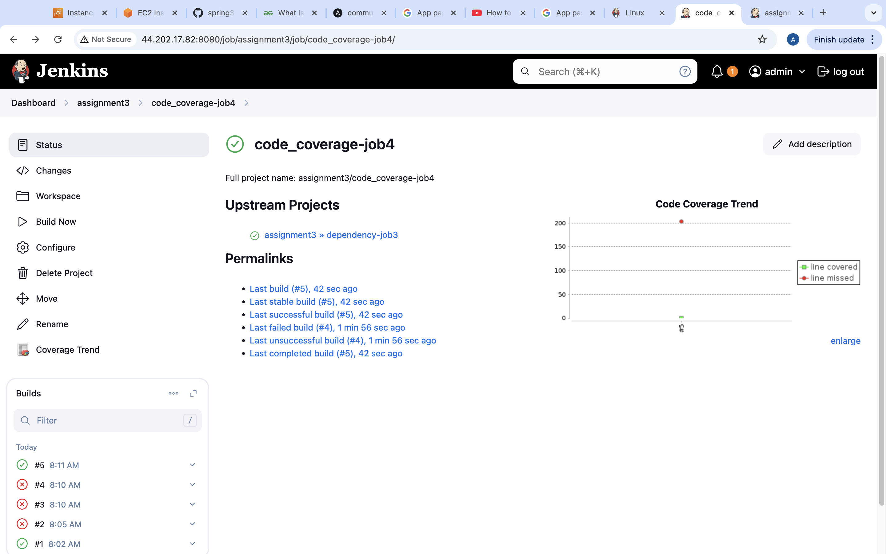
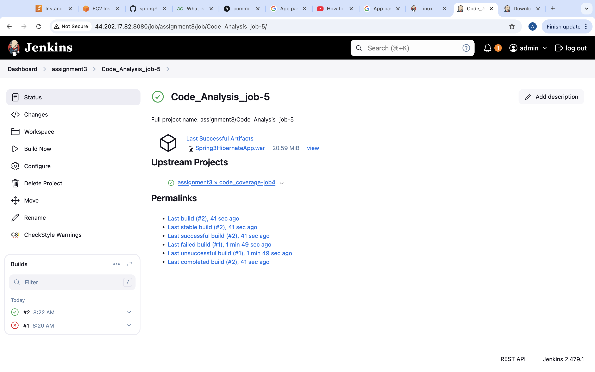

Assignment - 03

Perform CI checks on three Repositories using Jenkins, store reports, manage artifacts, and set up failure notifications.

API Repositories:

- Python:- https://github.com/OT-MICROSERVICES/attendance-api

- GoLang:- https://github.com/OT-MICROSERVICES/employee-api

- Java:- https://github.com/opstree/spring3hibernate.git java 11

Jenkins Freestyle Jobs:

* 		Create separate jobs for each check.
* 		Configure to pull repositories from GitHub.

* 		Implement Generic & Advance CI Checks (eg: Credential Scanning, Unit Testing, Code Coverage, Dependency, etc.)

* Credential Scanning

 
.png) 
.png) 
.png) 
.png) 
.png) 
.png) 

* Unit Testing

 
.png) 
.png) 
.png) 
.png) 
.png) 

* Dependency

 
.png) 
.png) 
.png) 

* Code Coverage

 
.png) 
.png) 
.png) 
.png) 
.png) 

 
.png) 
.png) 
.png) 
.png) 
.png)

* 		Store and access reports within Jenkins.

 

 
 
 
 
.png)

* 		Choose local or remote storage for artifacts.

.png)

* 		Configure email, Slack, or Telegram notifications on CI check failures.

