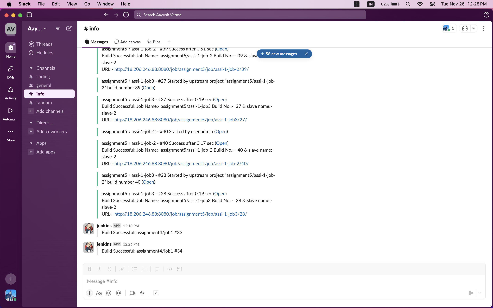

Assignment 4: 

Create a Declarative CI  pipeline for java based project that contains various stages like 
Code checkout
Run the below stages in parallel
Code stability.
Code quality analysis.
Code coverage analysis.
Generate a report for code quality & analysis.
Publish artifacts.

 
.png)

Send Slack and Email notifications.

 
 

[text](assignment4.groovy)

The user should be able to skip various scans during build execution. Before publishing there should be an approval stage to be set in place to approve or deny the publication and if approved the step should execute and the user should be notified post successful/failed

Optional:- Repeat the same using Scripted Pipeline.

API Repositories:

https://github.com/builderHub/CICD-01.git 