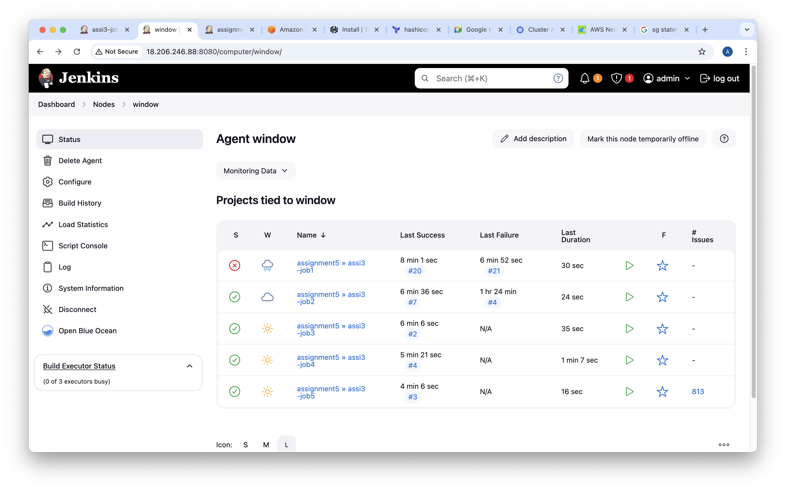
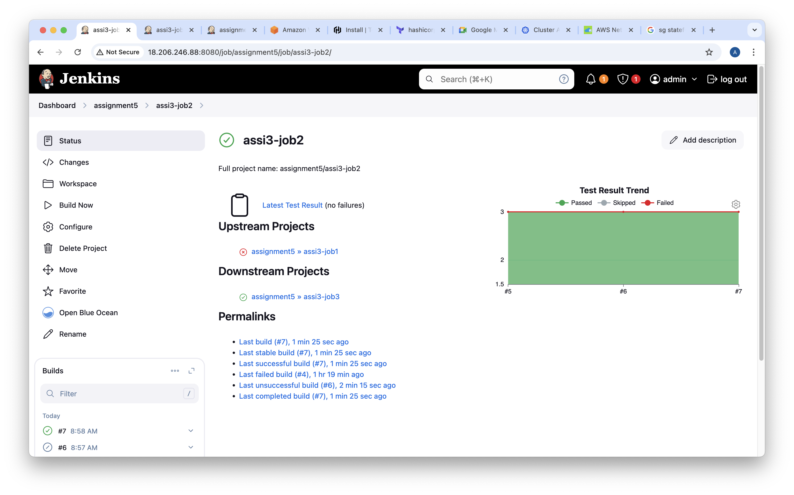

Assignment 05

Topics Covered:  (Configuring Agents, Distributing Loads, Executors, Assigning Nodes)

 
1] Configure an Ubuntu node using the execution of a command on the master method. 
    - Make sure at any point in time, a maximum of 5 jobs can be executed on this node.
    - Assign this node to Assignment 1: Part1

 
.png)
 
.png)  
 

2] Configure a RHEL node using  Launch slave agents via SSH method. 
    - Make sure at any point of time a maximum of 2 jobs can be executed on this node.
    - Assign this node to Assignment 1: Part2 

 

 
 

3] Configure a Window node using Launch slave agents via SSH method. 
     

    - Make sure at any point in time a maximum of 3 jobs can be executed on this node.
    - Assign this node to Assignment 3

 
 
 
 

 
 
 
.png) 
 
.png) 
 
.png) 
 

Generate a reports

 
 
 
 
 

Send Slack and Email notifications.

 
 
 
 
 

