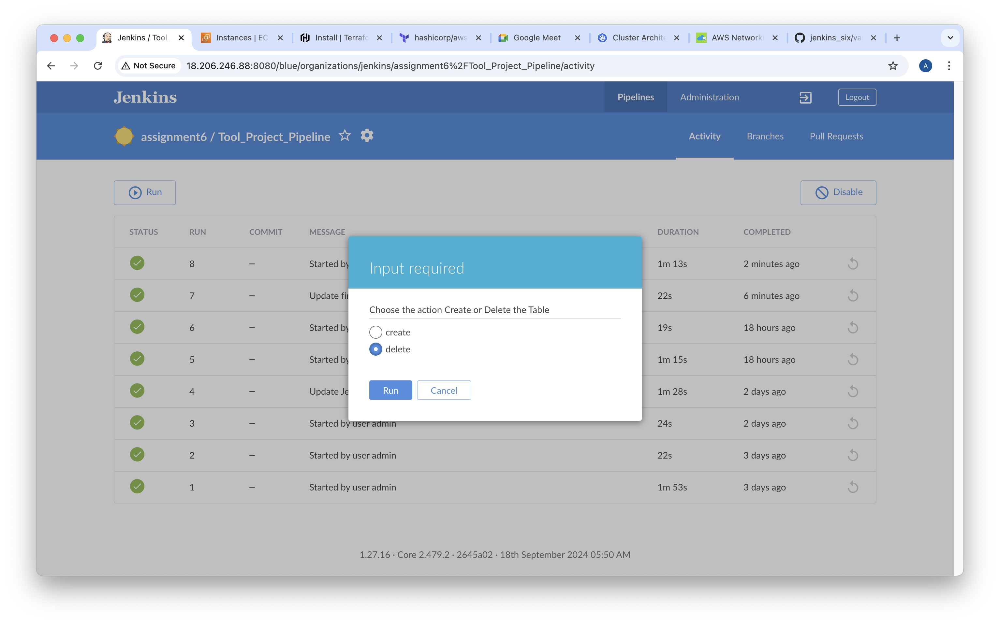

Assignment 6:

Create an ansible shared library in jenkins for your tool with the following steps:

- clone

- User Approval

- Playbook Execution

- Notification

Required inputs for the shared library should be passed via a configuration file

 

